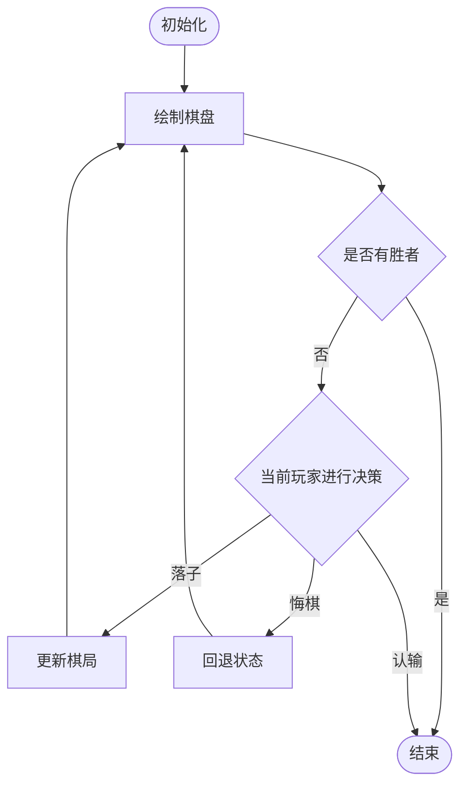
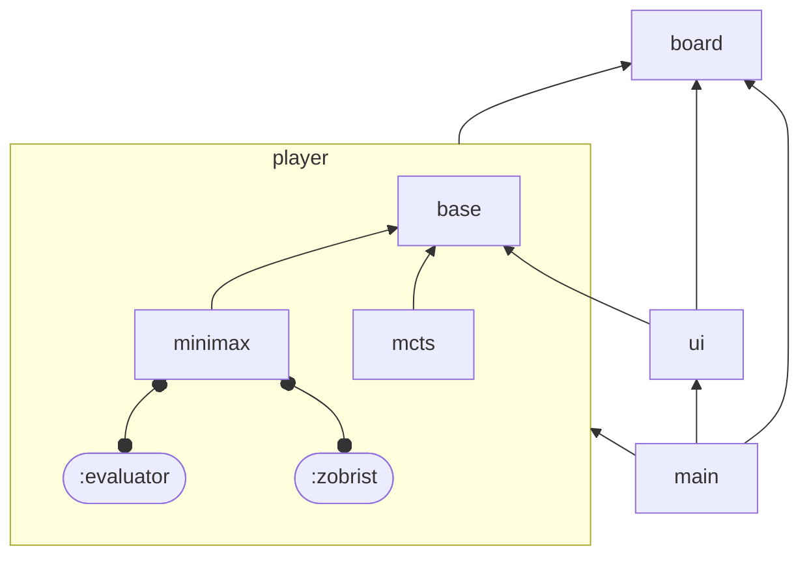

# 五子棋项目实验报告

姓名：滕鎧泽

学号：2023080905016

## 需求

- 正确绘制五子棋棋盘
- 实现人机对战
- 对代码进行模块化组织
- 防止 UI 阻塞（异步）

## 设计

### 游戏流程

我们可以将五子棋游戏拆解为如下图所示的流程



### 算法设计

五子棋作为典型的信息对称的零和游戏，可以使用对抗性搜索算法编写 AI

#### Minimax 搜索

博弈时，我方希望下一步的局面是自己胜算最大的局面，而对方则希望下一步的局面是我方胜算最小的局面，Minimax 搜索据此博弈树上的节点分为两类：**MAX** 与 **MIN**

- **MAX** 节点（我方节点）会选取所有子 **MIN** 节点中最大的分数作为自己的分数
- **MIN** 节点（对方节点）会选取所有子 **MAX** 节点中最小的分数作为自己的分数
- 特别的，叶节点（深度限制或达到终局）的分数为局面的评估值

Minimax 搜索的伪代码如下

```cpp
double MAX(int depthLeft, State state) {
    if (depthLeft == 0 || isTerminal(state)) {
        return evaluate(state);
    }
    double value = -inf;
    for (Action action : state.getActions()) {
        double score = MIN(depthLeft - 1, state.apply(action));
        if (score > value) value = score;
    }
    return value;
}

double MIN(int depthLeft, State state) {
    if (depthLeft == 0 || isTerminal(state)) {
        return -evaluate(state);
    }
    double value = +inf;
    for (Action action : state.getActions()) {
        double score = MAX(depthLeft - 1, state.apply(action));
        if (score < value) value = score;
    }
    return value;
}
```

#### Alpha-Beta 剪枝

由于五子棋的搜索树较大，其搜索量随着深度增加呈指数级增长，因此需要使用 Alpha-Beta 剪枝进行优化

设 $\alpha$ 代表目前所有可能解中分数的最大下界，$\beta$ 表示目前所有可能解中分数的最小上界，那么搜索树上最优解路径的节点的分数一定满足 $\alpha \le \text{score} \le \beta$

在搜索的的过程中，$\alpha$ 和 $\beta$ 会逐渐逼近，如果搜索过程出现 $\alpha \ge \beta$ 的情况，则当前节点不在最优解路径上。我们对该类节点进不进一步搜索，以完成对博弈树的剪枝

应用 Alpha-Beta 剪枝后的伪代码如下

```cpp
double MAX(int depthLeft, State state, double alpha, double beta) {
    if (depthLeft == 0 || isTerminal(state)) {
        return evaluate(state);
    }
    for (Action action : state.getActions()) {
        double score = MIN(depthLeft - 1, state.apply(action), alpha, beta);
        if (score > alpha) alpha = score;
        if (alpha >= beta) break;
    }
    return alpha;
}

double MIN(int depthLeft, State state, double alpha, double beta) {
    if (depthLeft == 0 || isTerminal(state)) {
        return -evaluate(state);
    }
    double value = +inf;
    for (Action action : state.getActions()) {
        double score = MAX(depthLeft - 1, state.apply(action), alpha, beta);
        if (score < beta) beta = score;
        if (alpha >= beta) break;
    }
    return beta;
}
```

### 模块划分



- `board` 负责五子棋棋盘的基本表示
- `player` 包含玩家相关的代码，其分为以下几个子模块：
    - `base` 定义了表示玩家的虚基类 `Player` 与玩家的操作 `Operation`
    - `minimax` 表示通过 Minimax 算法进行决策的 AI 玩家
        - `:evaluator` 分区包含估值函数的实现
        - `:zobrist` 分区负责棋盘的 Zorbrist 哈希计算
    - `mcts` 蒙特卡洛树搜索（未完善）
- `ui` 模块负责图形界面的绘制与交互
    
    该模块有对 `player.base` 模块的依赖，主要是因为以下两个原因：
    1. 人类玩家（`UIPlayer`）需要对 UI 进行交互以表达其做出的决策
    2. 一些 AI 玩家的决策时间可能较长，因此需要异步运行（`AsyncPlayer`），在等待时，我们需要不断更新 UI 防止阻塞
    
- `main` 模块包含游戏的主逻辑（初始化窗口、创建玩家、处理玩家决策等）

## 实现

### 棋局表示

五子棋棋局的代码表示是整个系统最为基础的部分，其表示方法分为有两种：

1. 落子序列：其优点在于保存了顺序信息，方便进行悔棋时的回退，空间利用率较高
2. 直接保存 $15 \times 15$ 棋盘上每一个格子的状态：通过位置获取棋盘上格子的状态时（如寻找相邻棋子、判断胜负、检查某一格是否被占用等使用情况），该方法的效率更优

实现中同时使用了两种表示方法，并支持落子序列到 $15 \times 15$ 棋盘的转换

### 玩家类设计

“玩家”这一概念的核心在于“根据已有的棋局进行决策”，我将其用虚基类 `Player` 表示，其中的成员函数 `decide` 接收之前落子序列的作为参数，返回玩家据此做出的决策

该层次的抽象有利于屏蔽人类玩家与 AI 玩家的区别，我们可以用统一的方式对两类玩家进行处理

另一方面，这也为运行时选择玩家类型提供了可能

### 算法优化

#### 最优子节点优先

在搜索中，记录当前局面的最优落子位置，下次遇到相同局面（通过 Zobrist 哈希判断）时，先搜索该位置，以快速产生较优的 $\alpha$ 与 $\beta$ 值进行剪枝

若遇到了 Zobrist 哈希冲突的情况（尽管非常罕见），该优化也不会导致出错，因为其本质上只改变了节点的搜索顺序，不会影响真正的返回值

还有一个好处在于，记录的最优落子位置可以直接作为 AI 玩家 `decide` 函数的返回值，否则我们需要对 Minimax 搜索中的 `MIN` 与 `MAX` 函数的返回值进行修改

#### 临近位置优先

对五子棋而言，已有棋子的附近大概率会有下一次的最优落子位置，因此我们会优先搜索附近位置（甚至仅搜索附近位置）

#### 副作用管理

Minimax 搜索中的 `MIN` 与 `MAX` 函数可以被实现为纯函数，但实际上，出于对性能的考虑，每次搜索一个子节点，我们都会更新局面（包括修改棋盘，更新哈希），搜索完成后再撤销更新

借鉴 React 中 `useEffect`（副作用与副作用的清理应集中在一处书写）与 C++ 中 RAII（资源与对象的生命周期相关联）的思想，我设计了一个辅助类来处理搜索中局面的更新

```c++
template <::std::invocable C, ::std::invocable D>
struct L {
    [[no_unique_address]] C c;
    [[no_unique_address]] D d;
    L(C c, D d): c(::std::move(c)), d(::std::move(d)) { ::std::invoke(this->c); }
    ~L() { ::std::invoke(this->d); }
};

// in class MinimaxPlayer::Searcher
auto doStep(Side side, Position pos) {
    return L(
        [=, this] {
            board[pos] = ::std::visit(
                overloaded{
                    make_matcher<Black>(Cell{Black{}}),
                    make_matcher<White>(Cell{White{}}),
                },
                side
            );
            steps.push_back({ .side = side, .pos = pos });
            hash ^= player->zobrist(side, pos);
        },
        [=, this] {
            board[pos] = ::std::monostate{};
            steps.pop_back();
            hash ^= player->zobrist(side, pos);
        }
    );
}

// when searching MIN or MAX
double score = [&]{
    auto _ = doStep(side, pos);
    return min() or max();
}();
```

这种方式不仅将修改的逻辑集中于一处以便于维护，还保证了异常安全

### 防止 UI 阻塞

若 AI 玩家的决策耗时较长，UI 可能会失去响应，通过异步可以解决这个问题

类 `AsyncPlayer` 继承 `Player`，但其并不表示一个真正的玩家，相反，其需要一个 `Player` 进行构造

当 `AsyncPlayer` 的 `decide` 方法被调用时，创建一个新线程调用储存的 `Player` 的 `decide`，同时在主线程的循环中更新 UI 防止阻塞，待另一个线程执行完毕，停止循环并返回

## 未来的发展方向

### C++20 Modules

截至目前（2023/12/25），CMake 已发布 3.28 版本，使用模块编写 C++ 代码已有较好的支持

抛开仍处于 development branch 的 GCC 14 不谈，CMake 支持使用 Clang 16+ 与 MSVC 扫描模块依赖并进行编译

目前，Windows 上 MSVC 工具链支持标准库模块，但 Visual Studio 对其补全的支持较差，编译时还可能遇到 C1001 内部编译器错误，其也不跨平台可用，遂放弃

LLVM 工具链中，libc++ 对标准库模块（`std` 和 `std.compat`）的支持仍处于实验性阶段，[配置较为复杂](https://libcxx.llvm.org/Modules.html#using-in-external-projects)

退而求其次，在多个文件使用全局模块片段以包含标准库标头及外部库时，会遇到奇怪的 ODR 问题，包括但不限于安全 CRT 相关的函数声明

通过在仅在单一模块文件中使用全局模块片段，再导出 using 声明看似能解决问题，但标准库中的重载运算符会无法使用（跨模块 ADL）

综上，该项目仍然采用传统的 header-only 方式组织源码，在编译器支持与标准库模块稳定之后，该项目会使用 Modules 进行改写

### Minimax 性能优化

在现有的 Minimax 算法的实现中，其决策耗时随着已有棋子的数量快速增加，可能是因为已有的估值函数耗时相对较长，其返回的分数不利于 Alpha-Beta 剪枝

目前的主要优化方向在于估值函数的重新设计，日后可能考虑多线程搜索

### MCTS（蒙特卡洛树搜索）

`src/player/mcts.hpp` 中包含了蒙特卡洛树搜索的基本实现，但在目前的游玩测试中，其 AI 智能程度未达到要求，未来会对其继续完善

### UI 优化

目前的 UI 较为简陋，主要改进方向如下

- 支持选择玩家类型与调整玩家属性（比如 `Evaluator` 中的权重）
- 美化棋盘与棋子贴图
- 添加音效
- 改善玩家等待体验，添加一些提示（`AsyncPlayer` 相关）
